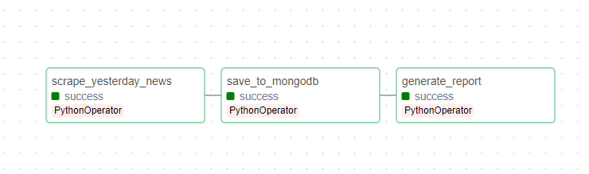
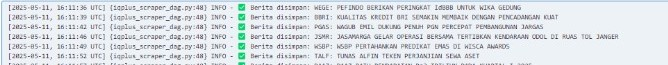
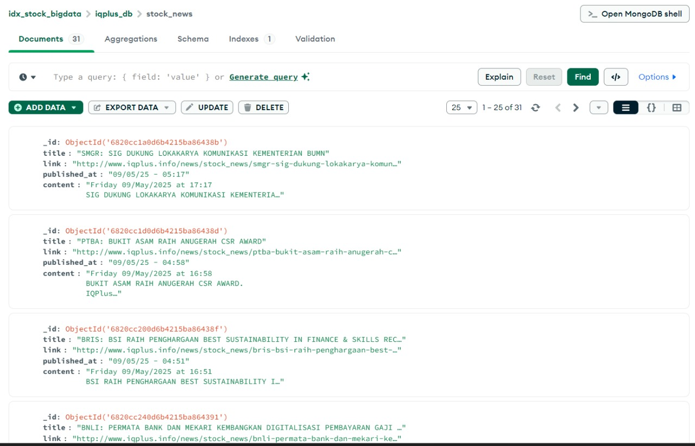
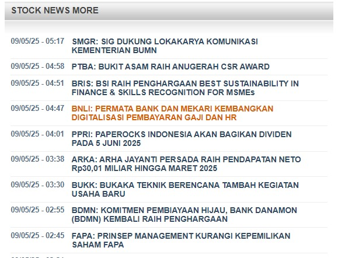

# IQPlus Scraper Airflow Project

## Deskripsi

Proyek ini adalah pipeline scraping otomatis berita saham dari situs IQPlus (http://www.iqplus.info) menggunakan Apache Airflow, Selenium, dan MongoDB. Pipeline berjalan setiap hari pada pukul 7 pagi, hanya mengambil berita yang dipublikasikan "kemarin" dan menyimpannya ke database MongoDB. Semua proses dijalankan secara terotomatisasi di dalam container Docker.

---

## Struktur Folder & File

```
.
├── dags/
│   └── iqplus_scraper_yesterday_dag.py   # DAG utama Airflow untuk scraping IQPlus
├── image-web-localhost/
│   ├── ambil-berita-kemarin(minggu).png  # Contoh hasil scraping (berita kemarin)
│   ├── graph.png                        # Diagram alur scraping
│   ├── ketika-berhasil-mengambil-berita.jpg # Screenshot hasil sukses
│   ├── scraping-tanggal12.jpg           # Screenshot scraping tanggal tertentu
│   └── store-mongodb.jpg                # Contoh data tersimpan di MongoDB
├── requirements.txt                     # Daftar dependensi Python
├── Dockerfile                           # Dockerfile untuk build image Airflow + Selenium
├── docker-compose.yml                   # Orkestrasi service Airflow & MongoDB
└── README.md                            # Dokumentasi ini
```

---

## Alur Program

1. **Airflow Scheduler** menjalankan DAG `iqplus_scraper_yesterday_dag.py` setiap hari jam 7 pagi (Asia/Jakarta).
2. **Selenium WebDriver** membuka halaman IQPlus dan menelusuri halaman berita.
3. **Filter**: Hanya berita yang tanggal publikasinya adalah "kemarin" yang diambil.
4. **Konten berita** diambil dan dibersihkan dari karakter non-UTF8.
5. **Data berita** disimpan ke MongoDB (hanya jika belum ada/unik berdasarkan link).
6. **Laporan** hasil scraping dicatat di log Airflow.

---

## Cara Menjalankan Program

### 1. Persiapan
- Pastikan Docker & Docker Compose sudah terinstall di komputer Anda.
- Pastikan MongoDB di Windows host Anda berjalan di port 27017 (atau gunakan container MongoDB yang sudah disediakan).

### 2. Build Docker Image
Buka terminal di folder project, lalu jalankan:
```powershell
# Build image airflow_scraper
$ docker-compose build
```

### 3. Jalankan Seluruh Service
```powershell
$ docker-compose up -d
```

### 4. Akses Airflow Web UI
- Buka browser dan akses: [http://localhost:8080](http://localhost:8080)
- Login dengan:
  - Username: `admin`
  - Password: `admin`
- Aktifkan DAG `iqplus_scraper_yesterday_dag` dan trigger secara manual jika ingin langsung menjalankan.

### 5. Cek Hasil Scraping
- Data berita akan tersimpan di MongoDB database `iqplus_db-scraping`, collection `stock_news`.
- Anda bisa cek hasilnya dengan MongoDB Compass atau tools lain.

---

## Penjelasan File Penting

- **dags/iqplus_scraper_yesterday_dag.py**: Script utama DAG Airflow. Mengatur scraping, filter berita kemarin, simpan ke MongoDB, dan generate report.
- **Dockerfile**: Build image Airflow + Selenium + ChromeDriver untuk scraping headless di container.
- **docker-compose.yml**: Orkestrasi service Airflow dan MongoDB, mapping port, volume, dan environment.
- **requirements.txt**: Daftar dependensi Python (Selenium, pymongo, dsb).
- **image-web-localhost/**: Berisi gambar-gambar dokumentasi dan hasil scraping.

---

## Contoh Gambar Dokumentasi

Berikut beberapa contoh hasil scraping dan alur program:

| Alur Scraping | Hasil Scraping | Data di MongoDB |
|--------------|----------------|-----------------|
|  |  |  |
| .png) |  | |

---

## Troubleshooting
- Jika Airflow tidak bisa diakses di `localhost:8080`, pastikan container sudah running (`docker ps`) dan port tidak bentrok.
- Jika scraping gagal, cek log Airflow di UI atau di folder `airflow_logs`.
- Pastikan MongoDB di host Windows menerima koneksi dari Docker (`host.docker.internal`).

---

## Lisensi
Proyek ini untuk keperluan pembelajaran dan tugas kuliah. Silakan modifikasi sesuai kebutuhan.
